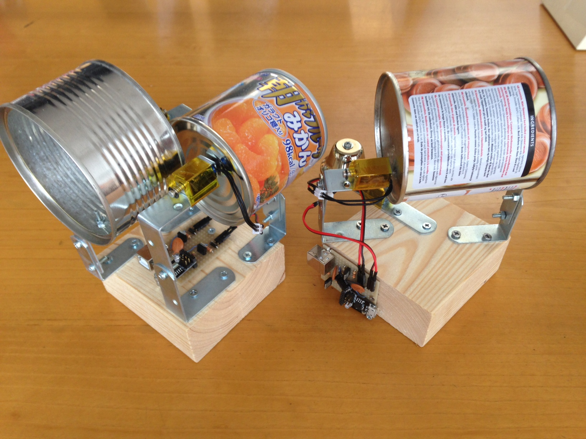
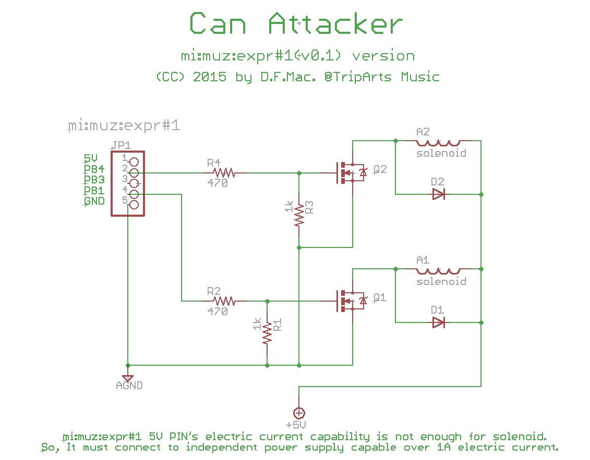
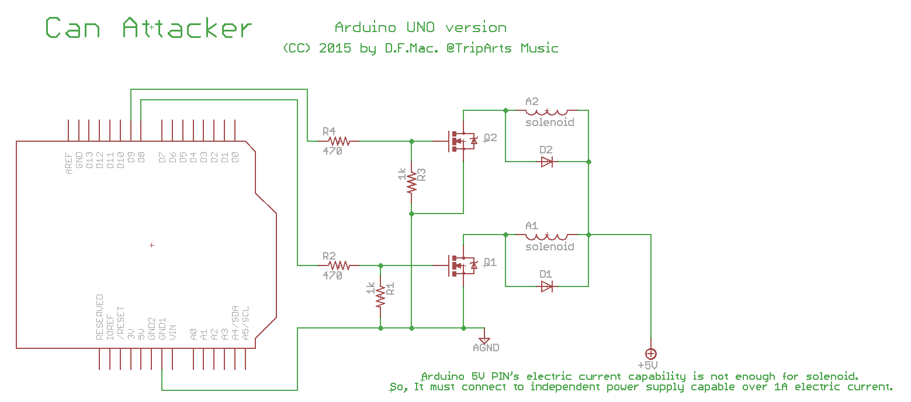

# can attacker

MIDI信号を受けてソレノイドで缶を叩くやつです。
「アコースティックリズムボックス！」と名乗っていますが、実際は缶を叩くだけの単純なものです。

# mi:muz:expr#1 Version

[Maker Faire Tokyo 2015](http://makezine.jp/event/makers2015/d_f_mac_at_triparts_music/)で展示したものは、[mi:muz:expr#1](https://github.com/tadfmac/mi-muz/tree/master/boards/expr1)で作ったものです。

mi:muz:expr#1は、LEDに利用しているPB3を除くと、PB1とPB4の2つしか空きポートがありません。
これら２つのポートにそれぞれMOSFET、ソレノイドを1つづつ接続して2つの缶を叩くデバイスを作りました。

## Version

v1.0 (2015.08.25)

## Schematics

## parts

- JP1: mi:muz:expr#1
- R1: 1kΩ
- R2: 470Ω
- R3: 1kΩ
- R4: 470KΩ
- Q1/Q2: [2SK4017](http://akizukidenshi.com/catalog/g/gI-07597/)
- D1/D2: 1N4007
- A1/A2: [5V Push Solenoid　ROB-11015](https://www.sparkfun.com/products/11015)

## Firmware

[Firmware](https://github.com/tadfmac/mi-muz/tree/master/applications/canattacker/can1_h/can1_h.ino)

# Arduino UNO Version

Arduino UNOでも作ってみました。

## Dependencies

Arduino UNOでUSB-MIDIを扱うために、[Arduino MIDI Library](http://playground.arduino.cc/Main/MIDILibrary)と、@morecat_labさん作[mocoLUFA](https://github.com/kuwatay)を利用させて頂いています。

## Version

v1.0 (2015.08.30)

## Schematics

## parts

- Arduino UNO Rev.3
- R1: 1kΩ
- R2: 470Ω
- R3: 1kΩ
- R4: 470KΩ
- Q1/Q2: [2SK4017](http://akizukidenshi.com/catalog/g/gI-07597/)
- D1/D2: 1N4007
- A1/A2: [5V Push Solenoid　ROB-11015](https://www.sparkfun.com/products/11015)

## Firmware

[Firmware](https://github.com/tadfmac/mi-muz/tree/master/applications/canattacker/can2_arduino/can2_arduino.ino)

# Arduino Leonardo Version

Arduino Leonardoでも作ってみました！！！！

## Dependencies

Arduino LeonardoをUSB-MIDIに対応させるため、[rkistner/arcore](https://github.com/rkistner/arcore)を利用させて頂きました！

利用方法は、[こちら](http://qiita.com/tadfmac/items/d685dae3e46d570386c3)を参照ください。

## Version

v1.0 (2015.11.25)

## Schematics

配線はArduino UNOバージョンとほぼ同じです。
ただし、下記のように変更しています。

|Arduino UNO Version|Arduino Leonardo Versionでの変更点|
|:----|:---:|
|PIN8|PIN2|
|PIN9|PIN3|

※スケッチがそうなっているというだけで、基本的にお好きなデジタル端子に繋げば大丈夫です。

## parts

- Arduino Leonardo
- R1: 100kΩ (変更してみました)
- R2: 470Ω
- R3: 100kΩ (変更してみました)
- R4: 470KΩ
- Q1/Q2: [IRLU3410PBF](http://akizukidenshi.com/catalog/g/gI-06025/) (2SK4017がどっか行ったので)
- D1/D2: 1N4007
- A1/A2: [5V Push Solenoid　ROB-11015](https://www.sparkfun.com/products/11015)

## Firmware

[Firmware](https://github.com/tadfmac/mi-muz/tree/master/applications/canattacker/can4_leonardo/can4_leonardo.ino)

# Licenses

 この 作品 は <a rel="license" href="http://creativecommons.org/licenses/by/4.0/">クリエイティブ・コモンズ 表示 4.0 国際 ライセンスの下に提供されています。</a>

