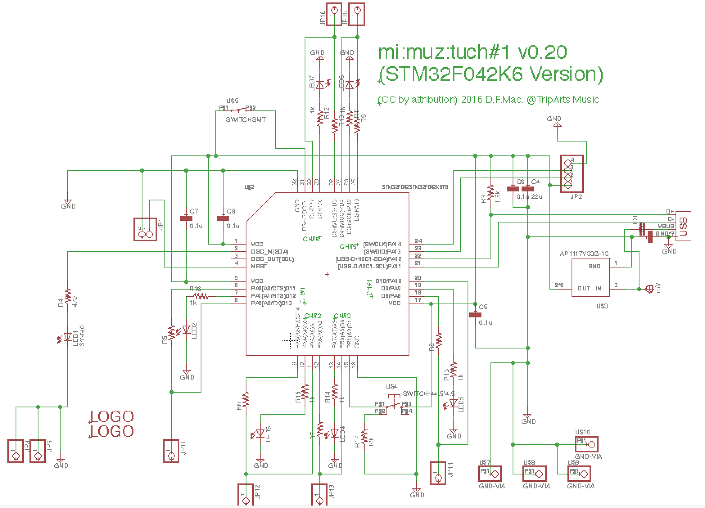
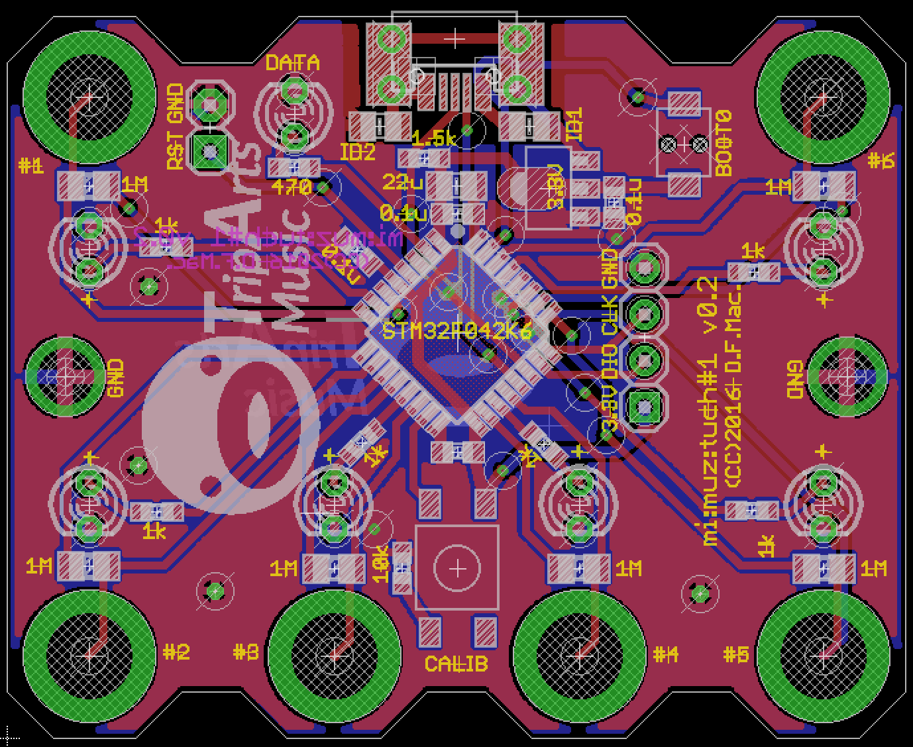

# mi:muz:tuch (MIDI Controller with flexible touch keys) STM32 Version

mi:muz:tuch is a USB MIDI controller with capacitive touch sensor.
It has now two indivisual versions, AVR or STM32.

And also, Web preset configurator is available to [Configurator](http://mz4u.net/tuch/).
MIDI note numbers be able to change to You want.  

# Common Usage

- USB Mode: mi:muz:tuch connect to PC via USB, work in USB mode.
- I2C Mode (v0.1x only): mi:muz:tuch connect to mi:muz:mstr, work in I2C mode.
- Connect to Objects: Any electricity objects to connect to the mi:muz:tuch's touch terminal via alligator clips.
- Calibration: Please push center switch.
- Touch! : When you touch to the any object, MIDI Note ON/OFF event corresponding to the touch channel will be sent to the PC.
- Let's Enjoy :D

# STM32 Version (STM32F042K6T6)

STM32 version of mi:muz:tuch (v0.2x) is my first STM32 project, it now only support USB Mode.

## Version

- v0.20 (2016.08.27)

## Known Issues

- v0.20 does not support I2C Slave Mode.

## Schematic

## Top View

## Eagle Files

[eagle files (v0.20)](./eagle-files/v0.20)

## parts

- [STM32F042K6T6](http://www.st.com/content/st_com/ja/products/microcontrollers/stm32-32-bit-arm-cortex-mcus/stm32f0-series/stm32f0x2/stm32f042k6.html) * 1
- [Ferrite beads](http://akizukidenshi.com/catalog/g/gP-04054/) * 2 [ID1,ID2]
- 470Ω(0603) * 1 (For USB DATA LED)
- 1kΩ(0603) * 6 (For touch line LED)
- 1.5kΩ(0603) * 1 (D+ Line Pull up)
- 10kΩ(0603) * 1 (Tactical switch pull down)
- 1MΩ(2012) * 6 (For Touch Sensor)
- 3mLED * 7 
- 0.1uF(0603) * 4
- 22uF(0805) * 1
- [Tactical Switch (4 points SMT 4.5mm)](http://www.aitendo.com/product/7047) * 1
- [Tactical Switch (2 points SMT)](http://www.aitendo.com/product/10525) * 1

## Software

- [Touch Sensor (for ATmega8A)](https://github.com/tadfmac/mi-muz/tree/master/applications/tuch/sketch/mega8_touchSensor/)

### Firmware Setup

1. Install [SW4STM32](http://www.st.com/content/st_com/ja/products/development-tools/software-development-tools/stm32-software-development-tools/stm32-ides/sw4stm32.html)
2. Install DFU Loader (i.e. dfu-util see [dfu-util - Device Firmware Upgrade Utilities](http://dfu-util.sourceforge.net/))
2. Copy [Source](./source/mimuz-tuch) to your workspace path and Bulding Software
3. Connect mi:muz:tuch board with holding push to 'BOOT0' Switch to USB Port
4. Burn [mimuz-tuch.bin] using DFU Loader. On Mac, enter the following command on shell in same mimuz-tuch.bin path.

> `dfu-util -a0 -d 0x0483:0xdf11 -s 0x008000000 -D mimuz-tuch.bin`

# Licenses

## Hardware (Schematics, Board, Eagle files), Software (Application, USB-MIDI Class Driver)

- [Creative Commons Attribution 4.0 International (CC BY 4.0)](http://creativecommons.org/licenses/by/4.0/)

## Software (STMCube from ST Microsystems)

- 3-clause BSD license

