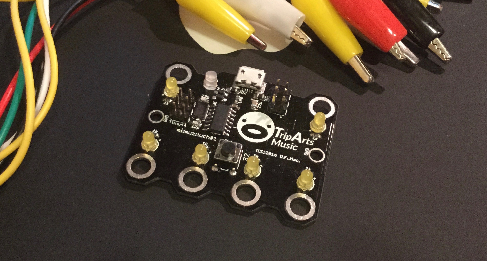
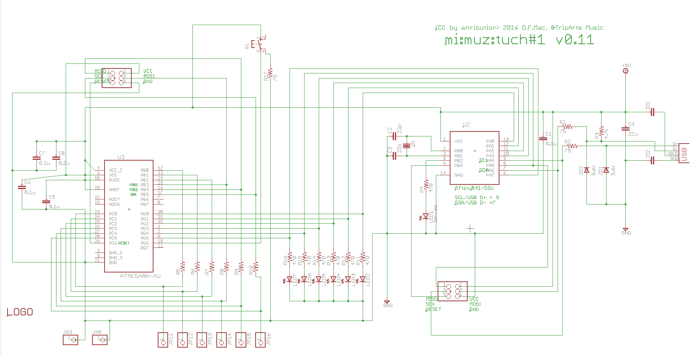
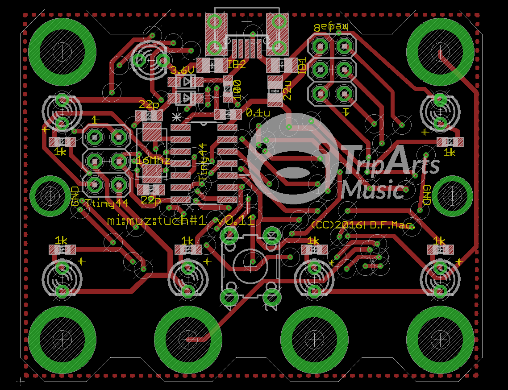
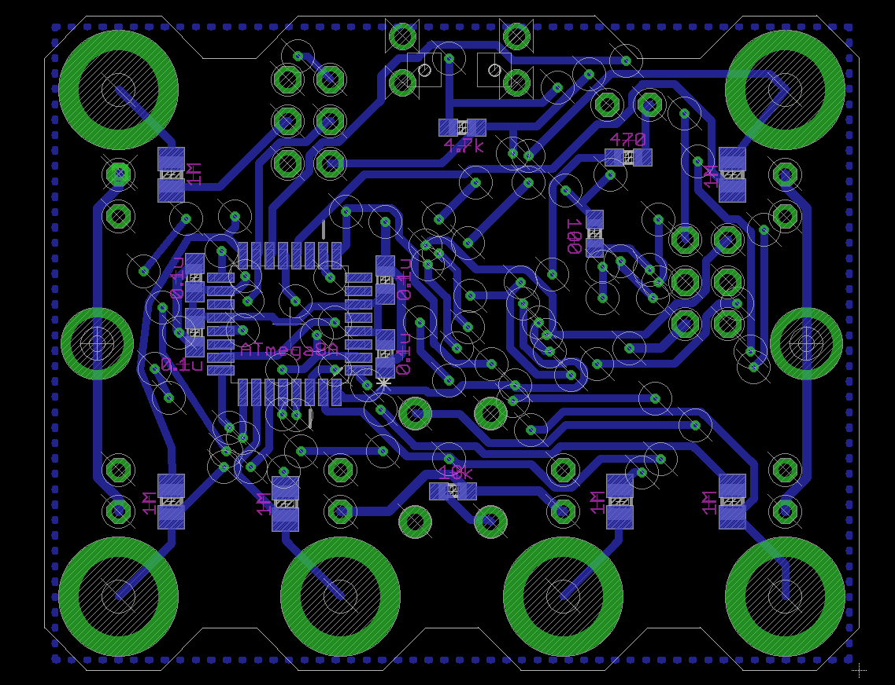

# mi:muz:tuch Hybrid MIDI touch sensor board

mi:muz:tuch is a 'Hybrid midi' controller with capacitive touch sensor.
'Hybrid MIDI' has been both support to USB-MIDI or I2C.

And also, Web preset configurator is available to [Configurator](http://mz4u.net/tuch/).
MIDI note numbers be able to change to You want.  

# Usage

- USB Mode: mi:muz:tuch connect to PC via USB, work in USB mode. WARNING: mi:muz:tuch does not work properly when connected to a USB2.0 Hub.
- I2C Mode: mi:muz:tuch connect to mi:muz:mstr, work in I2C mode.
- Connect to Objects: Any electricity objects to connect to the mi:muz:tuch's touch terminal via alligator clips.
- Calibration: Please push center switch.
- Touch! : When you touch to the any object, MIDI Note ON/OFF event corresponding to the touch channel will be sent to the PC.
- Let's Enjoy :D

# Version

v0.11 (2016.07.31)

# Schematic

# Top View

# Bottom View

# Eagle Files

[eagle files (v0.11)](./eagle-files/)

## parts

- [ATtiny44A-SSU](http://www.atmel.com/ja/jp/devices/ATTINY44A.aspx) * 1
- [ATmega8A-AU](http://www.atmel.com/ja/jp/devices/ATMEGA8A.aspx) * 1
- Zener diode(SOD323) 3.6V * 2
- Crystal 16Mhz (5032 2Pad) * 1
- [Ferrite beads](http://akizukidenshi.com/catalog/g/gP-04442/) * 2 [ID1,ID2]
- 100Ω(0603) * 2 (For USB D+, D- Line)
- 470Ω(0603) * 1 (For ATtiny44 LED)
- 1kΩ(0603) * 6 (For ATmega8A touch line LED)
- 4.7kΩ(0603) * 1 (D+ Line Pull up)
- 10kΩ(0603) * 1 (Tactical switch pull down)
- 1MΩ(2012) * 6 (For Touch Sensor)
- 3mLED * 7 
- 22pF(0603) * 2
- 0.1uF(0603) * 5
- 22uF(0805) * 1
- [Switch](http://akizukidenshi.com/catalog/g/gP-03651/) * 1
- Pin headers (2.54mm) 2×3 * 2
  WARNING: if you have v0.1 board, it has a bug that missing junction from ATmega8A to ISP.

# sketches

- [Touch Sensor (for ATmega8A)](https://github.com/tadfmac/mi-muz/tree/master/applications/tuch/sketch/mega8_touchSensor/)
- [Touch Sensor to Hybrid MIDI bridge (for ATtiny44A)](https://github.com/tadfmac/mi-muz/tree/master/applications/tuch/sketch/mimuz-tuch_v01/)

# Configurator

- [Sample](http://mz4u.net/tuch/)
- [Source](https://github.com/tadfmac/mi-muz/tree/master/applications/tuch/configurator/)

# Known issues

- [#4 bug: mi:muz:tuch ch#5 を触るとUSB通信が停止する問題](https://github.com/tadfmac/mi-muz/issues/4)

# Licenses

## Hardware (Schematics), Configurator

[Creative Commons Attribution 4.0 International (CC BY 4.0)](http://creativecommons.org/licenses/by/4.0/)

## Software (Sketches/Libraries)

[GNU General Public License, version 2 (GPL-2.0)](http://opensource.org/licenses/gpl-2.0.php).

See lso [HybridMidiAttiny](https://github.com/tadfmac/mi-muz/tree/master/arduino/libraries/HybridMidiAttiny).

