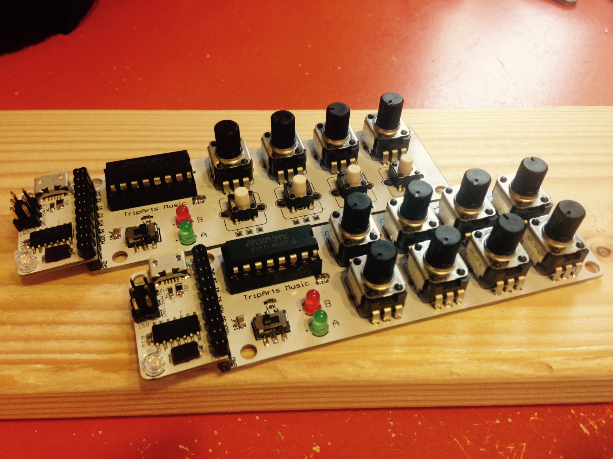
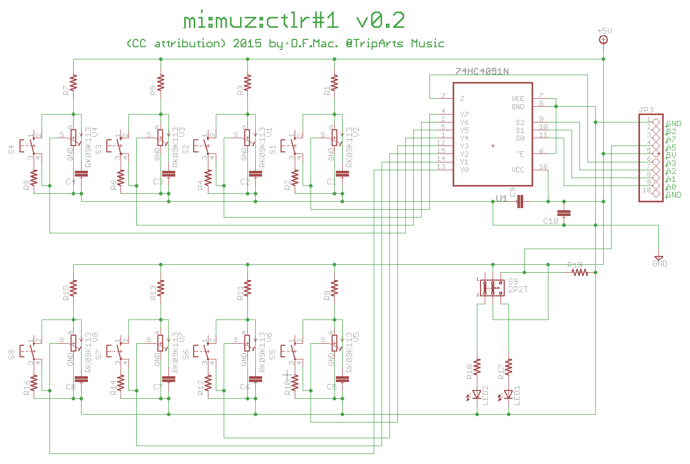

# mi:muz:ctlr#1 Controller Adaptor for mi:muz:expr#2

mi:muz:expr#2専用のコントローラーアタッチメントです。
最大8個まで、ボリュームかスイッチのいずれかを配置できるボードです。

# Version

v0.2β (2015.09.05)

# Schematics

以下はv0.2βの回路図です。近日中にv0.2版に差し替え予定です。
回路図は8個のスイッチと8個のボリュームが描かれていますが、4051の端子1つにつき接続可能なのは、スイッチかボリュームいずれか1つづつです。

v0.1は上記v0.2βとの違いとして4051のY0-Y3の間の接続順がv0.2β以降と逆になっています。（Y0→S5、Y1→S6、Y2→S7、Y3→S8の順になっています）

v0.2β→v0.2でJP3のA7にタクトスイッチが1つ追加されています。

## parts

- S1-S8:タクトスイッチ
- R1,R3,R5,R7,R9,R11,R13,R15,R17,R18:470Ω
- R2,R4,R6,R8,R10,R12,R14,R16,R19:10KΩ
- C1-C8:1uF
- RK09K113:アルプスRK09シリーズ 10KΩBカーブ
- C9:0.1uF
- C10:22uF
- U1:4051
- S9:2P2T
- LED1,LED2:3mmLED

# example

- [8個ボリュームコントローラー (v0.1用)](https://github.com/tadfmac/mi-muz/tree/master/boards/ctlr1/example/con8a0d_h/con8a0d_h.ino)
- [4個ボリューム+4個スイッチコントローラー (v0.1用)](https://github.com/tadfmac/mi-muz/tree/master/boards/ctlr1/example/con4a4d_470o_h/con4a4d_470o_h.ino)

# Licenses

 この 作品 は <a rel="license" href="http://creativecommons.org/licenses/by/4.0/">クリエイティブ・コモンズ 表示 4.0 国際 ライセンスの下に提供されています。</a>

