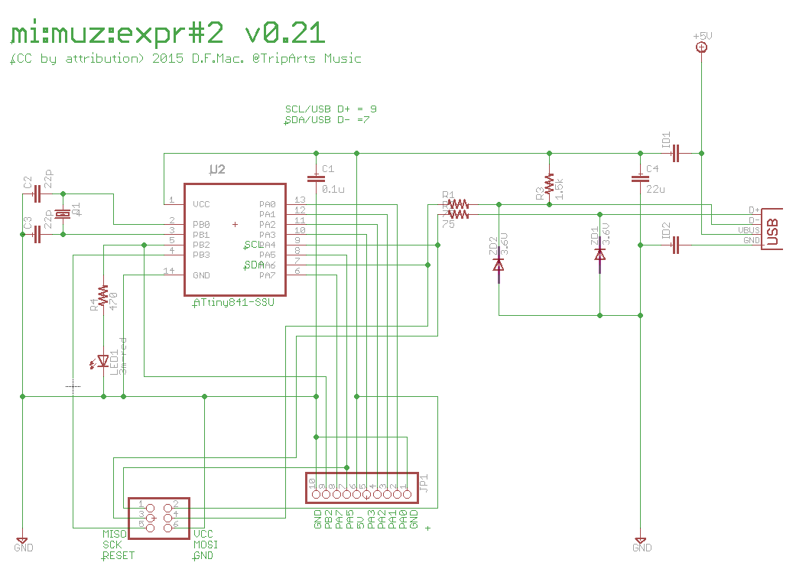

# mi:muz:expr#2 ATtiny841 Hybrid MIDI Test Board 

ATtiny841用のHybrid MIDI Test Boardです。
専用のファームウエア[HybridMidiATtiny](https://github.com/tadfmac/mi-muz/tree/master/arduino/libraries/HybridMidiAttiny)を利用することで、
USBに刺せばUSB MIDIデバイス、mi:muz:mstrシールドと組み合わせれば、I2C MIDIデバイスとして利用することができます。

# Version

v0.21 (2015.06.25)

# Schematics

## parts

- U1:ATtiny841-SSU
- JP1:ピンヘッダ (1×10PIN)
- JP2:ピンヘッダ (2×3PIN)
- ID1:Chip Indactor (フェライトビーズ)
- ID2:Chip Indactor (フェライトビーズ)
- ZD1:ツェナーダイオード3.6V
- ZD2:ツェナーダイオード3.6V
- C1:0.1uF
- C2:22pF
- C3:22pF
- C4:22uF〜
- R1:68-100Ω
- R2:68-100Ω
- R3:1.5KΩ
- R4:470Ω
- LED1:LED
- Q1:16Mhz

# example

- [blink_h:MIDI-INを受けてLEDチカするスケッチ(Hybrid MIDI Version)](https://github.com/tadfmac/mi-muz/tree/master/arduino/libraries/HybridMidiAttiny/examples/blink_h)
- [button_h:スイッチを押すとMIDI送信(Hybrid MIDI Version)](https://github.com/tadfmac/mi-muz/tree/master/arduino/libraries/HybridMidiAttiny/examples/button_h)
- [controller_h:ボリュームを回すとMIDIコントロール送信(Hybrid MIDI Version)](https://github.com/tadfmac/mi-muz/tree/master/arduino/libraries/HybridMidiAttiny/examples/controller_h)
- [sounder_h:シンセモドキ1号(Hybrid MIDI Version)](https://github.com/tadfmac/mi-muz/tree/master/arduino/libraries/HybridMidiAttiny/examples/sounder_h)

# Licenses

 この 作品 は <a rel="license" href="http://creativecommons.org/licenses/by/4.0/">クリエイティブ・コモンズ 表示 4.0 国際 ライセンスの下に提供されています。</a>

