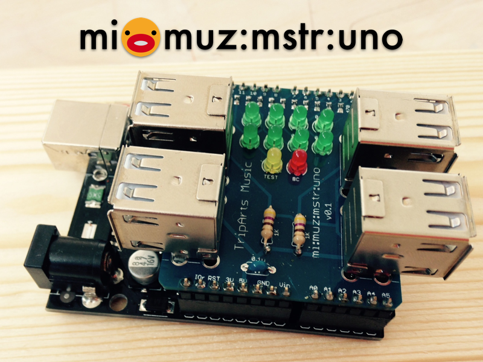
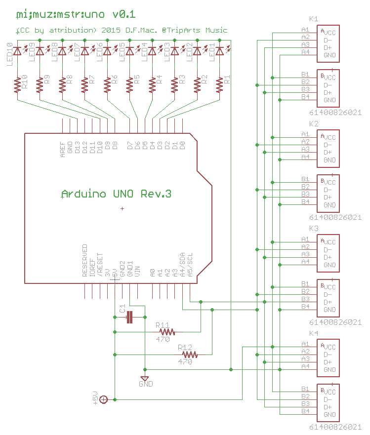

# mi:muz:mstr:uno mi:muz:expr

Arduino UNO Rev.3にmi:muz:exprシリーズのボードを接続するためのシールドです。
8台までのmi:muz:exprシリーズのボードを接続することができます。

物理コネクタにUSB-Aソケットを採用していますので、普通のUSBケーブルを用いてmi:muz:exprを接続できます。

# Version

v0.1 (2015.07.24)

# Schematics

## parts

- LED1-LED10:3mm LED
- K1-K4:USB Aソケット(2連)
- R1-R10:1KΩ
- R11,R12:470Ω
- C1:22uF
- R1:470Ω
- R2:470Ω
- ピンヘッダ 1列8連×3 1列6連×1

# scketch

- [mimuz-mstr-uno-v1](https://github.com/tadfmac/mi-muz/tree/master/boards/mstr-uno/sketch/mimuz-mstr-uno-v1/)

# Licenses

 この 作品 は <a rel="license" href="http://creativecommons.org/licenses/by/4.0/">クリエイティブ・コモンズ 表示 4.0 国際 ライセンスの下に提供されています。</a>

