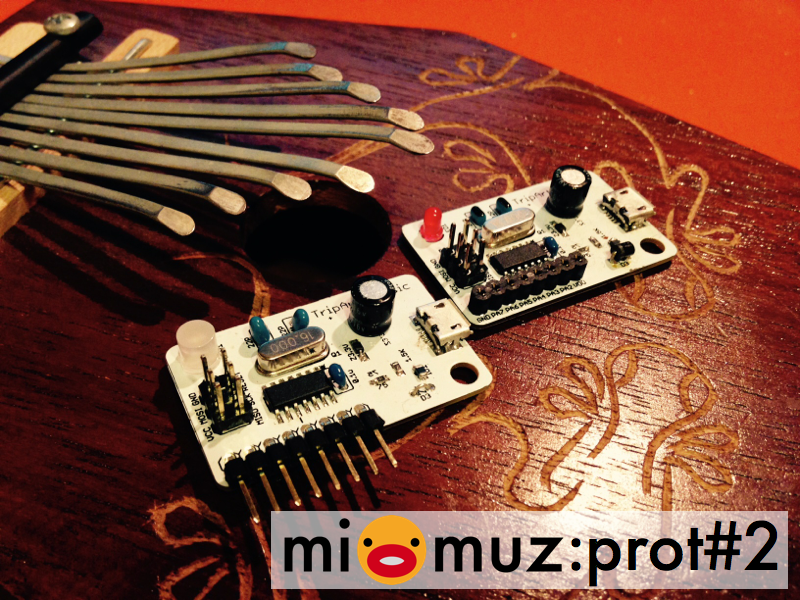

# mi:muz:prot#2 ATtiny44/84/841 V-USB MIDI Test Board 

ATtiny44/84/841用のV-USB MIDI Test Boardです。
14ピンATtinyを使っているので、prot#1やprot#3より利用できるIOが多いのが特徴です。

# Version

v1.0 (2015.04.29)

# Schematics

## parts

- U1:ATtiny44A-SSU or ATtiny84A-SSU or ATtiny841-SSU
- JP1:ピンヘッダ (2×3PIN)
- JP2:ピンヘッダ (1×8PIN)
- ID1:Chip Indactor (フェライトビーズ)
- ID2:Chip Indactor (フェライトビーズ)
- ZD1:ツェナーダイオード3.3V
- ZD2:ツェナーダイオード3.3V
- D3:電圧調整用ダイオード (1N4148/1S3/不要な場合はジャンパー)
- C1:47uF
- C2:0.1uF
- C3:22pF
- C4:22pF
- R1:68-100Ω
- R2:68-100Ω
- R3:1.5KΩ
- R4:470Ω
- R5:4.7KΩ ※I2C使うときだけ接続
- R6:4.7KΩ ※I2C使うときだけ接続
- LED1:LED
- Q1:16Mhz

# Licenses

 この 作品 は <a rel="license" href="http://creativecommons.org/licenses/by/4.0/">クリエイティブ・コモンズ 表示 4.0 国際 ライセンスの下に提供されています。</a>

