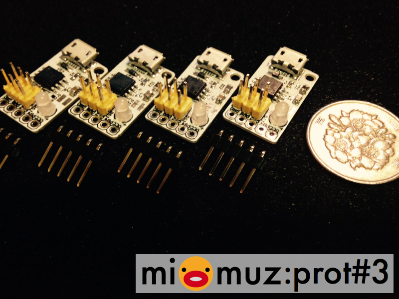

# mi:muz:prot#3 ATtiny45/85 V-USB MIDI Test Board 

ATtiny45/84用のV-USB MIDI Test Boardです。
V-USB-MIDIとI2Cとのブリッジ利用を想定し、USB D-をI2Cと競合しないPB3に接続しています。
また、I2Cプルアップ用の回路も入れてあります。

# Pin Mapping

# Version

v1.0 (2015.04.29)

# Schematics

## parts

- U1:ATtiny45-20SU or ATtiny85-20SU
- JP1:ピンヘッダ (2×3PIN)
- JP2:ピンヘッダ (1×5PIN)
- ID1:Chip Indactor (フェライトビーズ)
- ID2:Chip Indactor (フェライトビーズ)
- ZD1:ツェナーダイオード3.3V
- ZD2:ツェナーダイオード3.3V
- C1:0.1uF
- C2:10uF〜 (回路図0.1uFは誤り)
- R1:100Ω
- R2:100Ω
- R3:1.5KΩ
- R4:470Ω
- R5:4.7KΩ ※I2C使うときだけ接続
- R6:4.7KΩ ※I2C使うときだけ接続

# example

- [blink:MIDI-INを受けてLEDチカするスケッチ](https://github.com/tadfmac/mi-muz/tree/master/arduino/libraries/VUSBMidiATtiny/examples/blink)
- [sounder:シンセモドキ1号](https://github.com/tadfmac/mi-muz/tree/master/arduino/libraries/VUSBMidiATtiny/examples/sounder)

# Licenses

 この 作品 は <a rel="license" href="http://creativecommons.org/licenses/by/4.0/">クリエイティブ・コモンズ 表示 4.0 国際 ライセンスの下に提供されています。</a>

