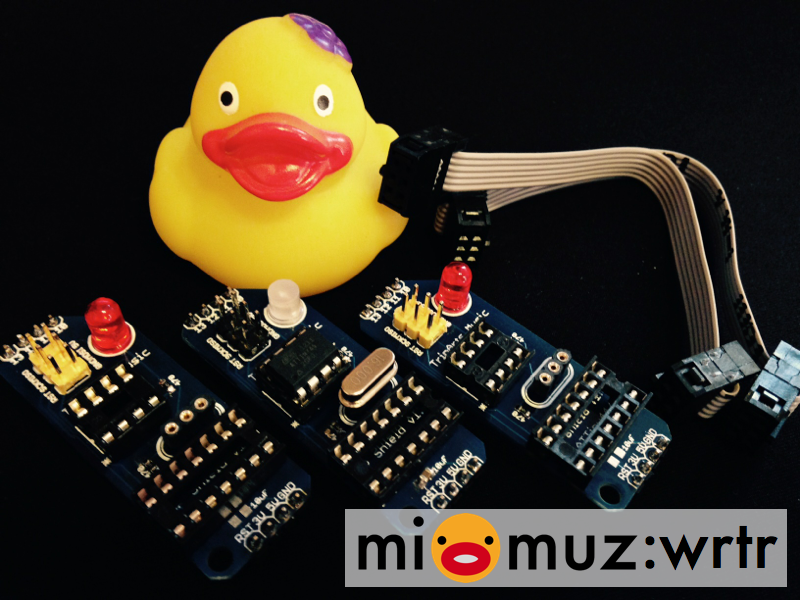

# mi:muz:wrtr ISP Shield for ATtiny x4/x5/x41

Arduino UNOなどに接続してATtiny45やATtiny44などにプログラムを書き込むためのISPライターシールドです。

# Version

v1.0 (2015.04.28)

# Schematics

## parts

- U1:14Pin DIPソケット
- U2:8Pin DIPソケット
- JP1:ピンヘッダ (4PIN)
- JP2:ピンヘッダ (4PIN)
- QF1:丸ピンヘッダ (3PIN)
- C1:0.1uF
- C2:0.1uF
- C3:10uF
- C4:22pF
- C5:22pF
- R1:470Ω
- R2:470Ω

# Licenses

 この 作品 は <a rel="license" href="http://creativecommons.org/licenses/by/4.0/">クリエイティブ・コモンズ 表示 4.0 国際 ライセンスの下に提供されています。</a>

